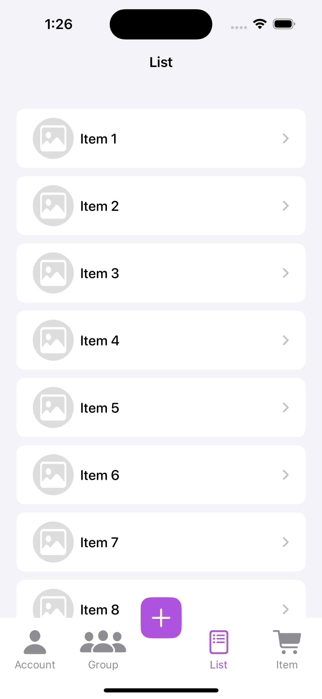

# BottomNavigationApp

BottomNavigationApp は、SwiftUI を使用して作成されたアプリで、ボトムバーナビゲーションを実装しています。 
また、UI に視覚的な効果を追加するために [SwiftUI-Shimmer](https://github.com/markiv/SwiftUI-Shimmer) を利用しています。

## ライセンス
このプロジェクトは MIT ライセンスのもとで提供されています。
